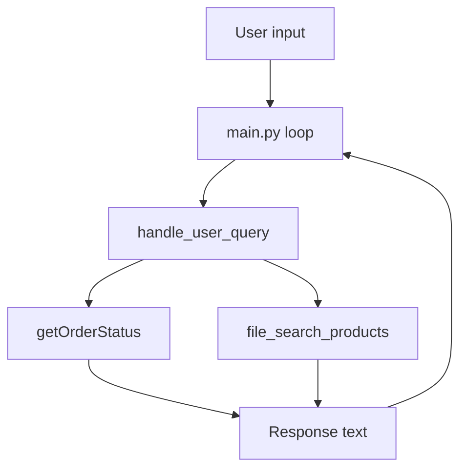

# Support Bot — Project Overview

## What this project is
A minimal Python customer support bot that can:

- Search [`products.json`](products.json) for product info
- Return mock order status via [`getOrderStatus()`](support_bot.py:32)
- Answer a user question with a simple decision flow in [`handle_user_query()`](support_bot.py:69)

This repo is set up as a small lab / starter project where you can inspect, run, and extend the bot.

## Quickstart

### Prerequisites
- Python 3.8+
- `pip`

### Create and activate a virtual environment (recommended)
```bash
python -m venv .venv
```

Activate:

- macOS / Linux / Git Bash:
```bash
source .venv/bin/activate
```

- Windows PowerShell:
```powershell
. .venv\Scripts\Activate.ps1
```

- Windows cmd.exe:
```bat
.venv\Scripts\activate.bat
```

If PowerShell prevents running the activation script:
```powershell
Set-ExecutionPolicy -ExecutionPolicy RemoteSigned -Scope CurrentUser
```

### Install dependencies
```bash
pip install -r requirements.txt
```

### Run
- Demo run:
```bash
python demo.py
```

- Interactive mode:
```bash
python main.py
```

## How it works (high level)



- [`main.py`](main.py) provides a simple REPL loop.
- [`handle_user_query()`](support_bot.py:69) tries to detect:
  - an order id (digits like `#12345`), then calls [`getOrderStatus()`](support_bot.py:32)
  - a product term (quoted text or the token `pro`), then calls [`file_search_products()`](support_bot.py:16)
- The response is a concatenated string containing any product + order results found.

## Configuration

### Environment variables
This project loads environment variables via [`load_dotenv()`](main.py:1) (see [`python-dotenv`](requirements.txt:1)).

Create a [`.env`](.env) file in the repo root if needed.

Common variable:
- `OPENAI_API_KEY` (optional) — mentioned in [`README.md`](README.md:44). The current bot implementation is file-based + mock tools and does not require this key unless you later add OpenAI API calls.

## Data

### Products catalog
Product data lives in [`products.json`](products.json) and is loaded by [`support_bot.py`](support_bot.py:1).

Expected shape (example):
```json
[
  {
    "id": "P1001",
    "name": "SmartWatch Pro",
    "description": "...",
    "category": "...",
    "price": 199.99
  }
]
```

Search logic:
- Case-insensitive substring match against `name`, `description`, or `category` in [`file_search_products()`](support_bot.py:16).

### Orders
Orders are not persisted.

[`getOrderStatus()`](support_bot.py:32) returns deterministic mock data based on the numeric portion of the provided order id.

## Repository structure
- [`support_bot.py`](support_bot.py) — core bot logic and tool-like functions
- [`main.py`](main.py) — interactive loop
- [`demo.py`](demo.py) — example run that prints debug details
- [`products.json`](products.json) — product catalog used by product search
- [`requirements.txt`](requirements.txt) — Python dependencies
- [`README.md`](README.md) — lab instructions and setup notes
- [`.env`](.env) — local environment variables (do not commit secrets)
- [`.venv/`](.venv/) — local virtualenv directory

## Extending the bot (common next steps)
- Add richer mock data to [`getOrderStatus()`](support_bot.py:32) (more items, carrier, last updated, etc.)
- Improve parsing in [`handle_user_query()`](support_bot.py:69) (support multiple products, more flexible order id formats)
- Add tests for parsing and search behavior
