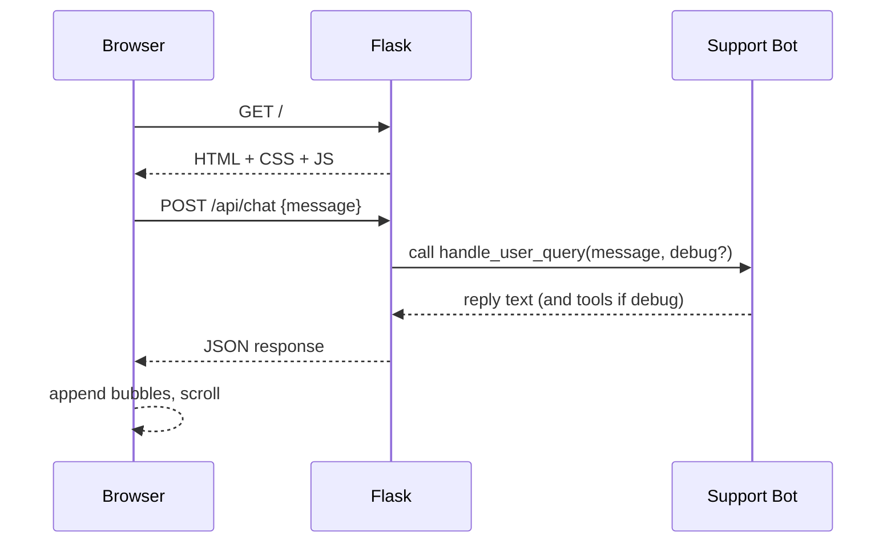

# Plan: Flask Chat UI for Support Bot

## Goal
Provide a clean, good-looking web interface to ask questions to the existing support bot, with chat history stored per-user in the Flask session (no disk persistence).

Key integration point: reuse [`handle_user_query()`](support_bot.py:69) as the backend response generator.

## Proposed UX

### Pages
- `GET /` (Chat)
  - Header: app name + short helper text
  - Scrollable chat transcript (user + bot message bubbles)
  - Message composer pinned to bottom
  - Optional buttons:
    - Clear chat
    - Toggle debug (show which tools were called)

### Chat behavior
- User sends a message
- UI immediately appends the user bubble
- Backend returns bot response
- UI appends bot bubble
- Transcript auto-scrolls to bottom
- Basic loading indicator while awaiting response

### Styling
- Use a simple modern layout:
  - centered container, max width ~900px
  - light background, card-like chat area
  - distinct bubble colors for user vs bot
  - monospace styling for debug blocks
  - responsive layout for mobile

## Architecture

### Backend (Flask)
- Use Flask + Jinja templates for server-rendered layout.
- Use a small JSON API endpoint to post messages and receive bot replies.

Routes:
- `GET /`
  - renders template with current session chat transcript
- `POST /api/chat`
  - accepts JSON: `{ message: string, debug: boolean }`
  - returns JSON: `{ ok: true, reply: string, tools_called?: [] }`
  - appends both user and bot messages to session transcript
- `POST /api/clear`
  - clears the session transcript

Session data format (stored in `session['chat']`):
```python
[
  {"role": "user", "text": "...", "ts": "2025-12-22T...Z"},
  {"role": "bot", "text": "...", "ts": "2025-12-22T...Z", "debug": {"tools_called": [...]}}
]
```

### Frontend
- One HTML page rendered by Flask.
- Minimal vanilla JS:
  - intercept form submit
  - call `fetch('/api/chat')`
  - render new bubbles dynamically
  - auto-scroll
  - handle errors



## Project structure changes
Add a new web app package to keep web UI separated from the bot logic.

Planned files:
- [`webapp/app.py`](webapp/app.py)
  - Flask app, routes, session handling
- [`webapp/templates/index.html`](webapp/templates/index.html)
  - main chat layout
- [`webapp/static/styles.css`](webapp/static/styles.css)
  - UI styles
- [`webapp/static/app.js`](webapp/static/app.js)
  - chat submission + rendering
- [`webapp/__init__.py`](webapp/__init__.py)
- Update [`requirements.txt`](requirements.txt:1) to add `flask` (and optionally `waitress` for production-ish serving)
- Update docs: add run instructions to [`README.md`](README.md:1) and optionally [`PROJECT_OVERVIEW.md`](PROJECT_OVERVIEW.md)

## Integration details
- Import backend function:
  - `from support_bot import handle_user_query`
- If debug toggle is enabled:
  - call `handle_user_query(message, debug=True)` and capture `tools_called`

## Security and operational notes
- Set `app.secret_key` from environment variable `FLASK_SECRET_KEY` (fallback to a dev default only for local).
- Cap session transcript length to avoid cookie bloat:
  - keep last N messages (e.g., 30)
  - truncate message text length (e.g., 2k chars)
- Don’t enable Flask debug mode by default.

## Running
- Dev:
  - `python -m webapp.app`
  - open `http://127.0.0.1:5000`

## Acceptance criteria
- Chat UI loads and looks clean on desktop and mobile.
- Messages persist across refresh within the same browser session.
- Clear chat button resets transcript.
- Posting a message calls [`handle_user_query()`](support_bot.py:69) and shows the reply.
- Basic error display if backend fails.

## Implementation steps (checklist)
- Create `webapp/` package and Flask app file with routes.
- Create template + static CSS/JS for chat.
- Update dependencies.
- Add docs for running the web UI.
- Quick manual test: ask product question and order question.
